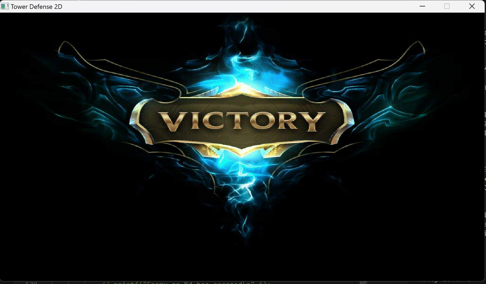

# 2D Tower Defense
## Ý tưởng
Hồi còn nhỏ, em thường chơi các game chiến thuật như đặt trụ bắn quái, gọi lính, tướng để giao tranh như AOE2,... bởi các game này có theme khá đa dạng, đồng thời Gameplay cũng đòi hỏi khá nhiều "não". Em cũng thấy game này có thiết kế không quá phức tạp, phù hợp để lập trình với trình độ của em.
## Tải xuống
Mọi người có thể làm theo các bước sau để có thể tải được Game:

- Tải mingw64 qua các hướng dẫn thuộc đường dẫn sau: https://www.mingw-w64.org/ .
- Clone repo này về máy.
- Do file Makefile sẽ hoạt động khác nhau dựa trên environment của mỗi máy, nên trong trường hợp mọi người muốn chạy được file thì mình khuyến khích sử dụng command prompt của GitBash (vì mình không biết cách chạy Makefile này trên command prompt thường). Quá trình cài GitBash đi kèm với quá trình cài sẵn Git trên Windows nên mình sẽ giả sử các bạn đã có GitBash rồi. Mọi người có thể vào Gitbash và gõ câu lệnh sau để compile được game 
```
> make 
```
- Sau khi thực hiện câu lệnh trên, các bạn có thể chạy file main.exe và chơi game thôi!

Repo này đã có sẫn tất cả các thư viện SDL2 mà các bạn cần khi chơi game, vì vậy các bạn sau khi setup SDL2 trên máy có thể thực hiện các bước trên để chơi game bình thường.
## Một số thông tin về Game
Game được cấu thành từ engine của SDL2, dựa trên các thư viện của SDL2 mà mọi người có thể tra cứu theo đường link sau. https://wiki.libsdl.org/SDL2/FrontPage. 

Mục tiêu của Game: Tiêu diệt tất cả các kẻ địch trước khi chúng vào được cổng không gian và gây tai họa cho các vũ trụ khác.

Các đối tượng trong game
- Đường đi của kẻ địch được đánh dấu bởi các ô vuông .
- Các ô vuông bao quanh đường đi, là các địa điểm mà người chơi có thể đặt các trụ để tiêu diệt kẻ địch được đánh dấu bởi các ô vuông 
- Cổng kết thúc , kẻ địch nếu đi đến được cổng này sẽ gây mất đi một số mạng.
- Số mạng còn lại, tối đa là 5, biểu diễn qua số  ở góc trên cùng màn hình.
- Số vàng còn lại để đặt trụ, biểu diễn qua  ở góc trái trên màn hình.
- Menu các trụ .
- Các trụ có thể đặt, bao gồm:
    + Trụ xám  có giá 50 vàng, tốc độ đánh 2 đòn/giây, sử dụng loại đạn thường  gây 1 sát thương mỗi viên.
    + Trụ xanh lá  có giá 100 vàng, tốc độ đánh 2 đòn / giây, sử dụng loại đạn xanh lá , gây 2 sát thương mỗi viên.
    + Trụ xanh dương  có giá 150 vàng, tốc độ đánh 0.5 đòn / giây, sử dụng loại đạn xanh dương , gây 5 sát thương mỗi viên.
    + Trụ đen  có giá 200 vàng, tốc độ đánh 5 đòn / giây, sử dụng loại đạn thường , gây 1 sát thương mỗi viên.
- Các loại kẻ địch bao gồm:
    + Kẻ địch xanh lá , có 3 máu, gây 1 sát thương nếu đến được cổng kết thúc, có giá 20 vàng nếu bị hạ gục.
    + Kẻ địch vàng ,có 5 máu, gây 2 sát thương nếu đến được cổng kết thúc, có giá 40 vàng nếu bị hạ gục.
    + Kẻ địch đỏ , có 10 máu, gây 3 sát thương nếu đến được cổng kết thúc, có giá 60 vàng nếu bị hạ gục.

## Cách chơi
- Để đặt trụ, trước hết các bạn click vào một ô có thể đặt trụ, được kí hiệu bởi  và chưa có trụ nào được đặt trước đó, sau đó ấn vào kí hiệu của trụ bạn muốn đặt ở  để đặt trụ. Sau khi thực hiện thành công, số vàng của bạn sẽ bị trừ bằng giá của trụ, và trụ sẽ được đặt tại vị trí bạn chọn.
- Lần lượt các đợt kẻ địch sẽ xuất hiện và đi theo đường đi được kí hiệu bởi , nếu các bạn sống sót được qua 5 đợt quái mà không mất hết mạng các bạn sẽ chiến thắng.
- Ngược lại, nếu các bạn hết mạng trước khi hết 5 đợt quái, các bạn sẽ thua.
- Sau khi đặt trụ, nếu có kẻ địch đi tới 1 trong 8 ô xung quanh trụ, trụ sẽ tự động tấn công kẻ địch cho đến khi chúng hết máu hoặc đi ra ngoài tầm bắn của trụ.
## Game Screenshots

Một screenshots trong lúc game chạy: 


Screenshot khi chiến thắng: 


Screenshot khi thất bại:


## Những hạn chế còn tồn tại

Game vẫn tồn tại nhiều điểm có thể cải thiện được trong tương lai:

- Sửa lại việc hiển thị đường đạn, đôi khi đạn bay quá nhanh không hiển thị kịp, đôi khi đạn lại bay loạn lên.
- UI còn khó hiểu, cần có thêm phần hiển thị giá tiền của trụ, máu của kẻ địch cho game dễ hiểu hơn.
- Còn xảy ra lag, tụt FPS.

Do trình độ lập trình Game còn hạn chế và thiếu kinh nghiệm cũng như thử nghiệm, phiên bản game 2D Tower Defense này còn nhiều tồn tại cần được khắc phục, ngoài ra cũng chưa được thử nghiệm trên các môi trường khác nhau ở các hệ điều hành khác nhau. Mong mọi người thông cảm!

## Những điều đã học được trong quá trình

- Tìm hiểu sâu rộng về engine SDL2 để làm game bằng C++.
- Rèn luyện kĩ năng làm Project, lập trình hướng đối tượng trong C++.
- Áp dụng thư viện TTF của SDL2 để bổ sung vào Game.

## Một số nguồn tài liệu mình tham khảo:

- Hình ảnh background lấy từ https://pngtree.com/freebackground/stunning-space-background-texture-elements-captured-by-nasa-in-high-quality-photograph_13440379.html.
- Hình ảnh chiến thắng và thất bại lấy từ game Liên Minh Huyền Thoại.
- Ý tưởng về game 2D Tower Defense bắt nguồn từ https://www.youtube.com/watch?v=wplX3HQKk4k.
- Makefile, các cách sắp xếp thư viện, file ban đầu dựa trên https://github.com/RainbowBunny/Sky-Garden.